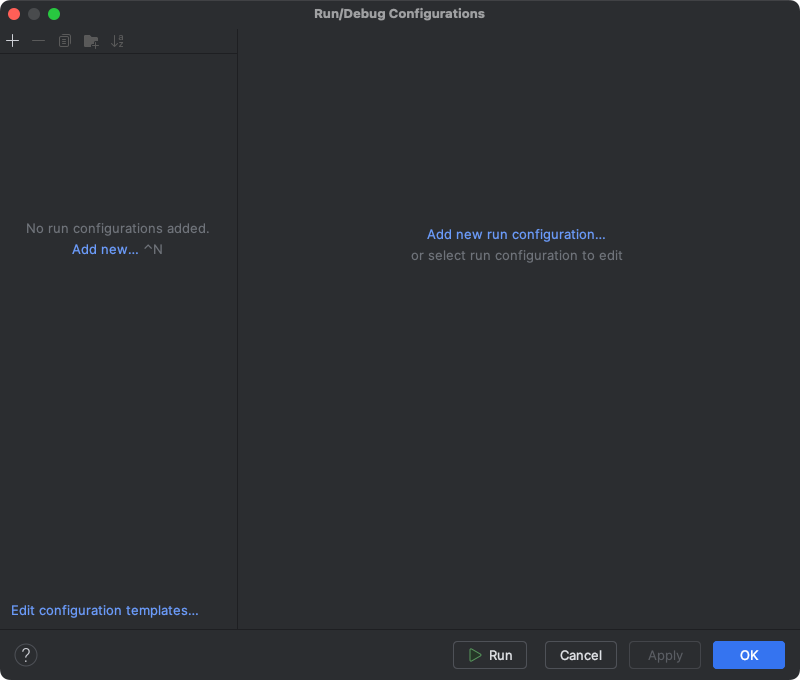
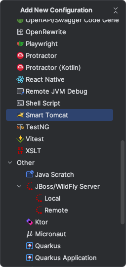
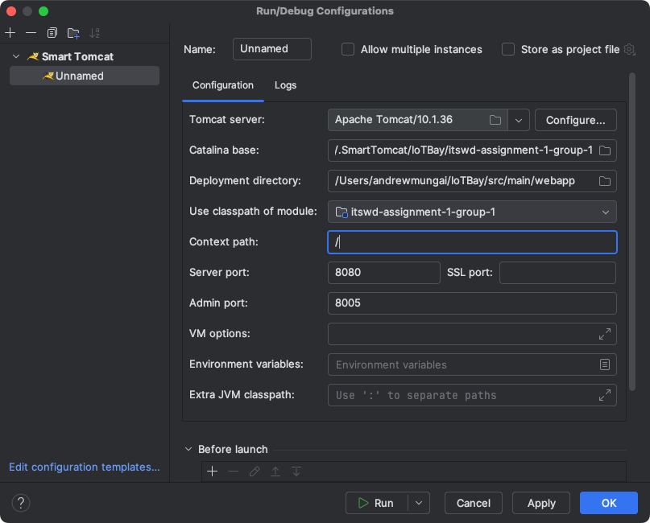
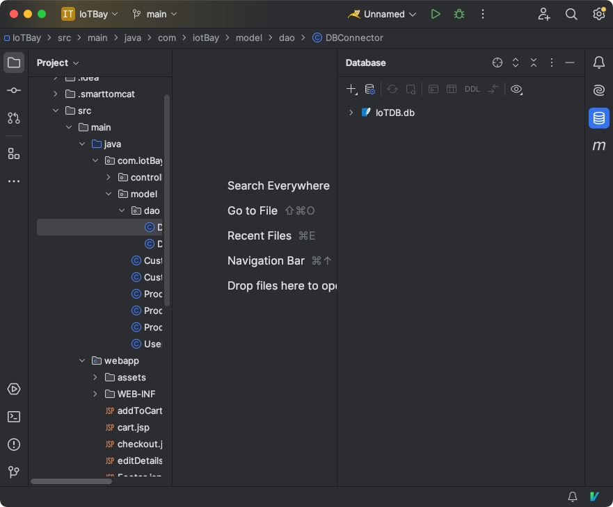
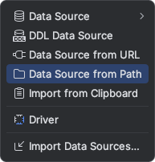
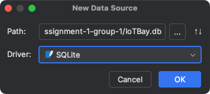
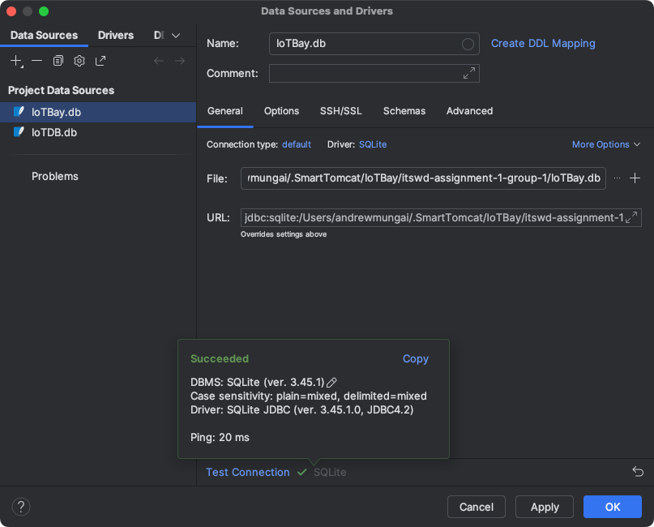
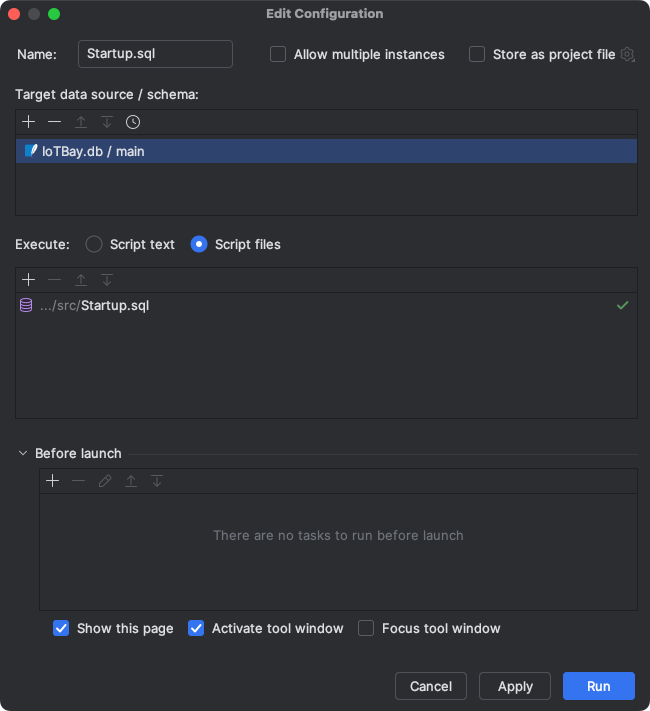
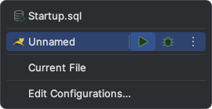

---

# IoTBay Web Application

This is a JSP/Servlet-based web application for an IoT product e-commerce platform called **IoTBay**.

The application allows users to browse products, manage a cart, register/login, and complete a checkout process with order and payment recording.

---

## Features

* User registration and login
* Product catalogue with IoT devices
* Checkout with order and payment handling
* View payment history with sort/filter functionality
* View order history with sort/filter functionality
* Change personal details including:

    * Shipping information
    * Credit card information
    * Personal details

---

## Tech Stack

* **Front End**: HTML, CSS
* **Back End**: Java Servlets, JSP
* **Database**: SQLite
* **Server**: Apache Tomcat
* **Build Tool**: IntelliJ / Maven

---

## How to Run Locally (Instructions for IntelliJ & macOS)

1. Clone the repository and open it in IntelliJ.
2. In the top menu bar, navigate to `Run -> Edit Configurations...`
3. Select `Add new run configuration`

<br>



<br>

4. When prompted with `Add New Configuration`, select `Smart Tomcat`

<br>



<br>

5. Leave all other options as default, but change `Context Path:` to `'/'`

<br>



<br>

6. To run the application locally, you will need to create a database in the `.SmartTomcat` directory and point the `DBConnector` class to it:

    1. Locate the directory of your Smart Tomcat server. On Mac systems this is usually located at:
       `/Users/*your-username*/.SmartTomcat/IoTBay/itswd-assignment-1-group-1/`
    2. In there, create a new file called `IoTBay.db`
    3. Copy the absolute path (e.g., `/Users/andrewmungai/.SmartTomcat/IoTBay/itswd-assignment-1-group-1/IoTBay.db`)
    4. In the IntelliJ right-side menu bar, select the **Database** icon

<br>



<br>

5. Click the `+` icon and select `Data Source > SQLite`

<br>



<br>

6. Locate the `IoTBay.db` on your system and select `SQLite` as the driver

<br>



<br>

7. Click **Test Connection** to ensure everything is working

<br>



<br>

8. Navigate to `src/main/java/com/IoTBay/model/dao/DBConnector.java`
   Change line 17 to the file path you copied earlier. It should look like:

```java
String url = "jdbc:sqlite:/Users/andrewmungai/.SmartTomcat/IoTBay/IoTBay.db";
```

7. Navigate to `src/Startup.sql`, right-click and run the file. When prompted, connect it to the database created earlier.

<br>



<br>

8. Now simply run the project from the top menu bar:

<br>



---

## 🎉 Welcome to IoTBay!

Enjoy exploring IoT products and managing your orders with ease!

---

